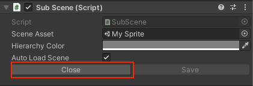
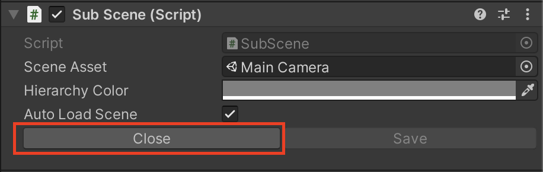
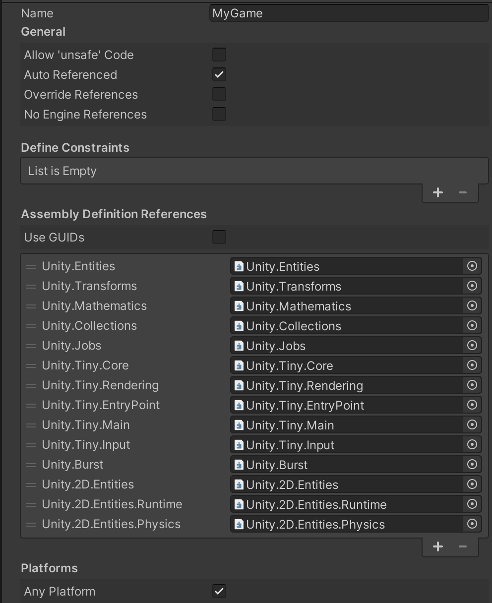
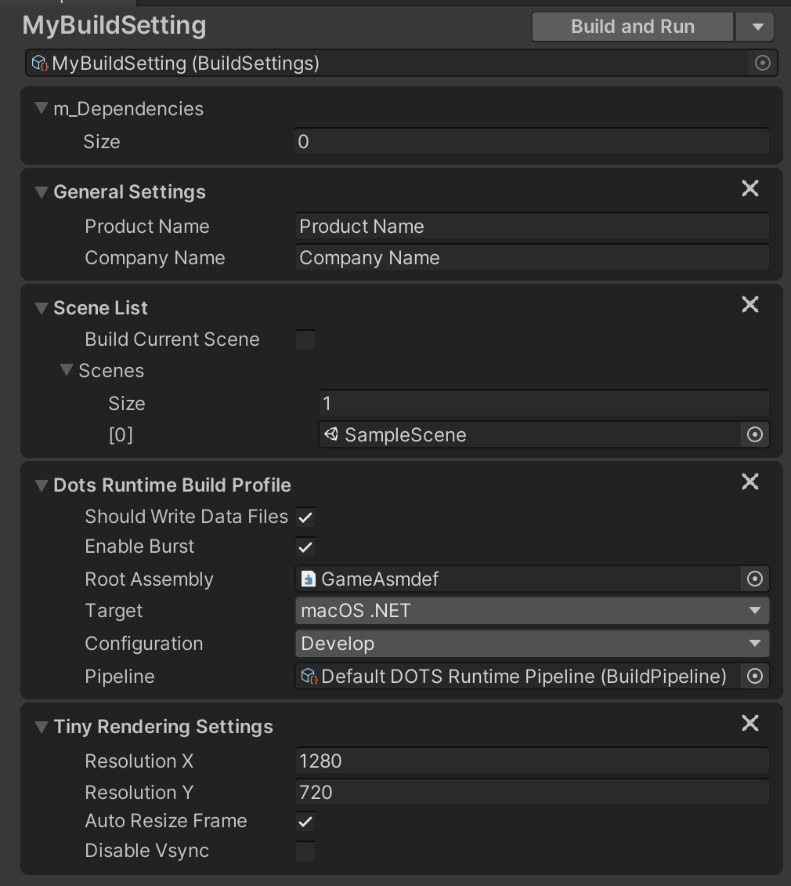

# Getting started with 2D Rendering

## Package requirements

For the package installation and build requirements, please refer to [Project Tiny’s System Requirements](https://docs.google.com/document/d/1A8hen2hLFY5FLkC5gd3JP2Z-IpHfnAX-CpYLK3aOdwA/edit#heading=h.od6pqxv78b97) for more details.

## Quick start

To get started quickly, download the [2D Entities Starter](https://github.com/Unity-Technologies/2D-Entities-Starter/archive/0.22.0-preview.7.zip) template Project. This Project has everything setup for you to get started with the 2D Entities package. 

## Setting up your Project from scratch

1. From the [Unity Hub](https://unity3d.com/get-unity/download), create a [new Project](https://docs.unity3d.com/Manual/GettingStarted.html) by selecting the 2D Project Template.
2. Use the [Unity Package Manager](https://docs.unity3d.com/Manual/upm-ui.html) (menu: __Window__ > __Package Manager__) to [find](https://docs.unity3d.com/Manual/upm-ui-search.html) and install the 2D Entities preview package. If the package is not visible, select __Show preview packages__ from the [Advanced](https://docs.unity3d.com/Manual/upm-ui-find.html) drop-down menu.
3. Ensure that __Live Link Mode__ is enabled by going to __DOTS > Live Link Mode > Live Conversion In Edit Mode__
4. Ensure that the Project is using Asset Pipeline version 2 by going to __Edit > Project Settings > Editor > Asset Pipeline > Mode > Version 2__

## Rendering your Sprite with the DOTS pipeline

1. Open ``SampleScene.unity`` located in the ``Assets/Scenes`` folder.

2. Add a Sprite to your Project, then drag and drop it into the Scene. Ensure it is a root GameObject and not the child of an existing GameObject.

3. Right-click on the __Main Camera__, and select __New SubScene From Selection__.

   * This will create a SubScene named ‘Main Camera’ and move the __Main Camera__ into it.

4. Right-click the Sprite, and select __New SubScene From Selection__.

   * This will create a SubScene named after the Sprite GameObject, and move the Sprite GameObject into it.

     

5. Close the __SubScene__ containing your Sprite GameObject.

   * Nothing changes visually, but doing this destroys the GameObject and only the DOTS object is left behind.

   - If the SubScene does not continue to render, please retry the steps.

__Note:__ To allow the Game view Camera to render using the DOTS pipeline, keep the Main Camera SubScene open in Edit mode at all times by selecting the __Edit button __in its Inspector window.



If the __Close__ button is visible when selecting the SubScene, you are currently in Edit Mode.

## Author data into the DOTS world

For information about how to author data into the DOTS world, see the [Authoring and Editor-only Code](https://docs.google.com/document/d/1A8hen2hLFY5FLkC5gd3JP2Z-IpHfnAX-CpYLK3aOdwA/edit#heading=h.w5i2mxyiwr4g) section in the Project Tiny docs.

## Building a DOTS Runtime package

To learn about what is an Assembly Definition and why it is required, see Project Tiny’s [Root Assembly Definition](https://docs.google.com/document/d/1A8hen2hLFY5FLkC5gd3JP2Z-IpHfnAX-CpYLK3aOdwA/edit#heading=h.jhlsjguwq2h5) documentation for more information.

### Creating the root assembly definition

1. Create a new folder for runtime scripts, and call it for instance __Runtime__.

2. In the new __Runtime__ folder, create a new __Assembly Definition__ by going __Right-click > Create > Assembly Definition__, and call it __MyGame__.

3. Select the __MyGame__ Assembly Definition created in step 2, and input the same name in the __Name__ field as the .asmdef name, which is ‘MyGame’ in this case.

4. Clear __Use GUIDs__ checkbox.

5. Add (+) the following Assembly Definition References from the list of available assemblies:

   * Unity.Entities
   * Unity.Transforms
   * Unity.Mathematics
   * Unity.Collections
   * Unity.Jobs
   * Unity.Tiny.Core
   * Unity.Tiny.Rendering
   * Unity.Tiny.EntryPoint
   * Unity.Tiny.Main
   * Unity.Tiny.Input
   * Unity.Burst
   * Unity.2D.Entities
   * Unity.2D.Entities.Runtime
   * Unity.2D.Entities.Physics

6. Press the __Apply__ button.

   

### Additional platform support

Open the package manifest.json located in ``Root/Packages``, and add the packages for the platforms you want your Project to support to the dependency list:

```
"com.unity.platforms.android": "0.1.8-preview.3",
"com.unity.platforms.desktop": "0.1.8-preview",
"com.unity.platforms.ios": "0.1.8-preview.3",
"com.unity.platforms.linux": "0.1.8-preview",
"com.unity.platforms.macos": "0.1.8-preview",
"com.unity.platforms.web": "0.1.8-preview.1",
"com.unity.platforms.windows": "0.1.8-preview",
```

### Creating a Build Setting

1. Create a new folder for the __Build Settings__ of the DOTS Runtime, and call it for instance __BuildSettings__
2. In the new __BuildSettings__ folder, create the Build Settings by going __Right-click > Create > Build > BuildSettings for DOTS Runtime__.
3. Select the Build Setting and do the following updates:

   1. In the __Scene List__, set the size of the Scenes’ array to 1; then drag in SampleScene.unity.
   2. In __Dots Runtime Build Profile__, drag the Assembly Definition created in step 2 onto the __Root Assembly__ box.
   3. In __Dots Runtime Build Profile__, select the intended target in the __Target__ box.
   4. Press the (+) in the lower right corner and select __Tiny Rendering Settings__
   5. Note, if you are targeting Web, there is one last step
      * Press the (+) in the lower right corner and select __Emscripten Settings__.
      * In the __Emscripten Settings__, set the size of the EmccArgs’ array to 1; then add __TOTAL_MEMORY=256MB__
4. Press the __Apply__ button
5. Select __Build and Run__ at the top of the build target window.

For additional information about the Build Settings, see the [Build Settings](https://docs.google.com/document/d/1A8hen2hLFY5FLkC5gd3JP2Z-IpHfnAX-CpYLK3aOdwA/edit#heading=h.b1mok15sprsc) section in the Project Tiny’s docs.



### Debugging a build

For information about debugging a build, see Project Tiny’s [Dots C# Project](https://docs.google.com/document/d/1A8hen2hLFY5FLkC5gd3JP2Z-IpHfnAX-CpYLK3aOdwA/edit#heading=h.flt05qfyo528) documentation.

---

If you have any issues or questions about the __2D Entities__ package and its features, please visit the [Project Tiny](https://forum.unity.com/forums/project-tiny.151/) forum and [First batch of 2D Features for Project Tiny is now available](https://forum.unity.com/threads/first-batch-of-2d-features-for-project-tiny-is-now-available.830652/) thread for more information and discussions with the development team.