# GameObject conversions

When working with DOTs, GameObjects located inside SubScenes are converted into their [Entity Component System](https://docs.unity3d.com/Packages/com.unity.entities@0.14/manual/ecs_core.html) (ECS) counterparts. This converted data is used during runtime in the DOTs systems. Refer to ECS’ [GameObject Conversion](https://docs.unity3d.com/Packages/com.unity.entities@0.14/manual/gp_overview.html#gameobject-conversion) documentation for more details.

In the section below, we have listed the conversion of the components and assets in 2D Entities.

## Sprite

The mesh and texture data is converted and stored onto an [Entity](https://docs.unity3d.com/Packages/com.unity.entities@0.14/manual/ecs_entities.html) acting as the Atlas for the data. If there are more meshes using the same texture, these meshes are also stored onto the same Entity. 

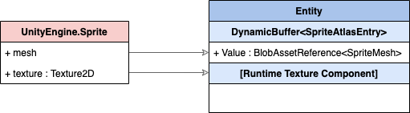

Apart from the Atlas Entity, Unity also creates an Entity with a Unity.U2D.Sprite component. The Sprite component contains two pieces of data:

- Which Atlas Entity its data is stored on. 
- Which index in the array of meshes its mesh is stored at.

For an overview of how the different entities and components interact with each other after conversion, refer to the [diagram](#entitieschart) below.

## Sprite Renderer

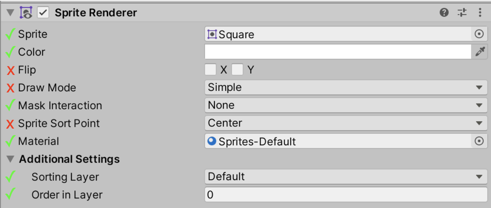 Only properties with green check marks are converted over to the ECS environment.

| Property             | Conversion details                                           |
| -------------------- | ------------------------------------------------------------ |
| **Sprite**           | The [Sprite data is converted](#Sprite) and the `Unity.U2D.Entities.SpriteRenderer` stores a link to the `Unity.U2D.Entities.Sprite Entity` |
| **Color**            | Converted into a float4.                                     |
| **Mask Interaction** | Converted into `Unity.U2D.Entities.SpriteMaskInteraction`.   |
| **Sorting Layer**    | Converted into a short.                                      |
| **Order in Layer**   | Converted into a short.                                      |

Here is a visual representation over how the `UnityEngine.SpriteRenderer` properties map over in ECS:

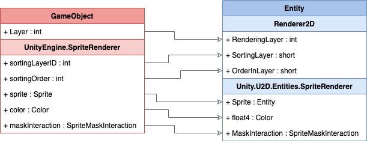

The following flowchart shows how the different 2D rendering Entities and their components interact with each other: 

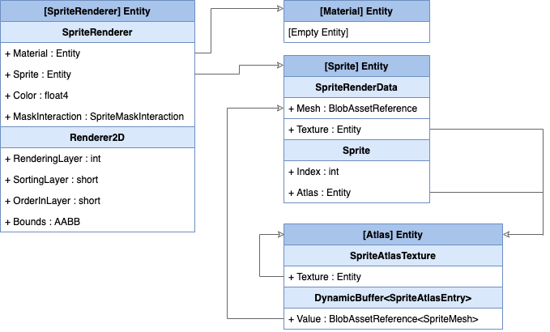

## Rigidbody 2D

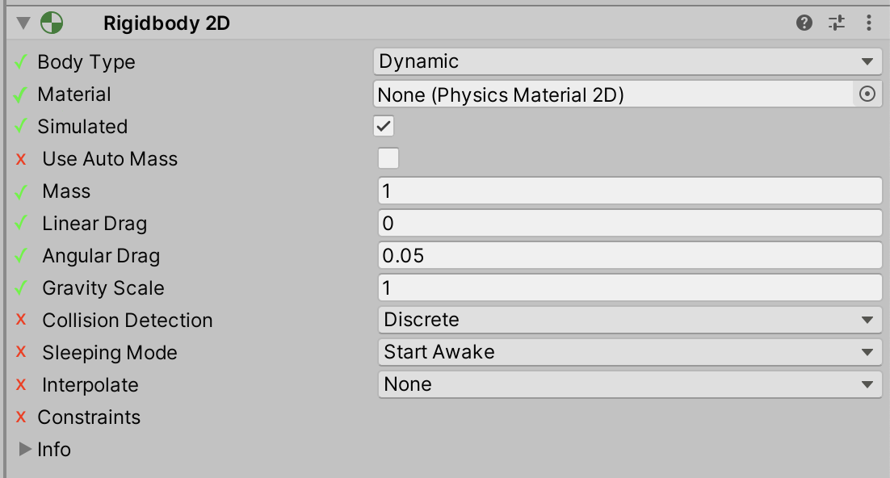  Only properties with green check marks are converted over to the ECS environment.

| Property          | Conversion details                                           |
| ----------------- | ------------------------------------------------------------ |
| **Body Type**     | Different sets of components are added onto the final Entity depending on Body Type (see below for conversion charts for each type). |
| **Material**      | The Physic Material is copied over as is. If no Material is assigned, the default Physic Material is assigned and converted instead. |
| **Simulated**     | If this is not checked, the Rigidbody is not converted.      |
| **Mass**          | This value is inverted during conversion.                    |
| **Linear Drag**   | Copied over as is.                                           |
| **Angular Drag**  | Copied over as is.                                           |
| **Gravity Scale** | Copied over as is.                                           |

### Body Type: Dynamic

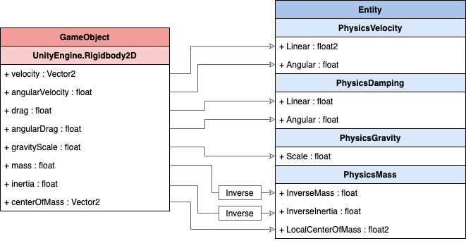

### Body Type: Kinematic

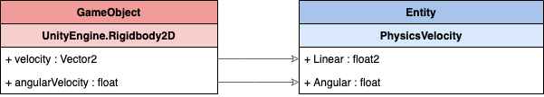

### Body Type: Static

A **Static** Rigidbody2D will not generate any of the above components.

## Collider

The Collider data is converted and stored into a generic [Blob Asset](https://docs.unity3d.com/Packages/com.unity.entities@0.14/manual/ecs_components.html). The reference to the Blob Asset is then stored inside a `PhysicsColliderBlob` component. 

This component is added alongside the Entity that contains any converted Rigidbody2D components. If there is no Rigidbody2D then the component is added to the Entity related to the GameObject the Collider2D is on.

Do note that if the Collider isn’t [Enabled](https://docs.unity3d.com/ScriptReference/Behaviour-enabled.html) or if its [usedByComposite](https://docs.unity3d.com/ScriptReference/Collider2D-usedByComposite.html) property is set to true, then it will **not** be converted to ECS.

The following Collider2D types can be converted over to ECS:

- [BoxCollider2D](#boxcollider2d)
- [CapsuleCollider2D](#capsulecollider2d)
- [CircleCollider2D](#circlecollider2d)
- [PolygonCollider2D](#polygoncollider2d)

**Note:** There is a current known limitation where multiple Collider 2Ds on the same GameObject will produce a warning from the GameObject conversion system as it does not support multiple components on the same Entity. This restriction will be removed in a future update.

### BoxCollider2D

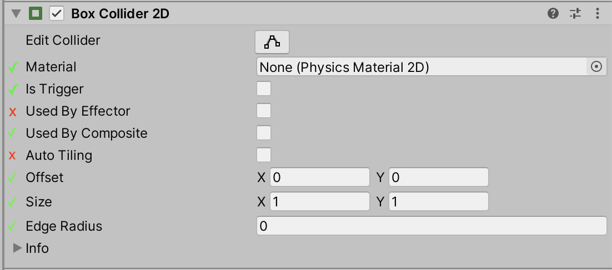 Only properties with green check marks are converted over to the ECS environment.

| Property              | Conversion details                                           |
| --------------------- | ------------------------------------------------------------ |
| **Material**          | The Physic Material is copied over as is. If no Material is assigned, then the Physic Material will be taken from Rigidbody2D that owns this Collider instead. If the Rigidbody2D also has no Material assigned, then the default Physic Material will be assigned. |
| **Is Trigger**        | Trigger status of the Physic Material is taken into account during conversion. |
| **Used By Composite** | If selected, the Collider is not converted.                  |
| **Offset**            | This is transformed into world space.                        |
| **Size**              | This value is multiplied with `transform.lossyScale`.        |
| **Edge Radius**       | Copied over as is.                                           |

### CapsuleCollider2D

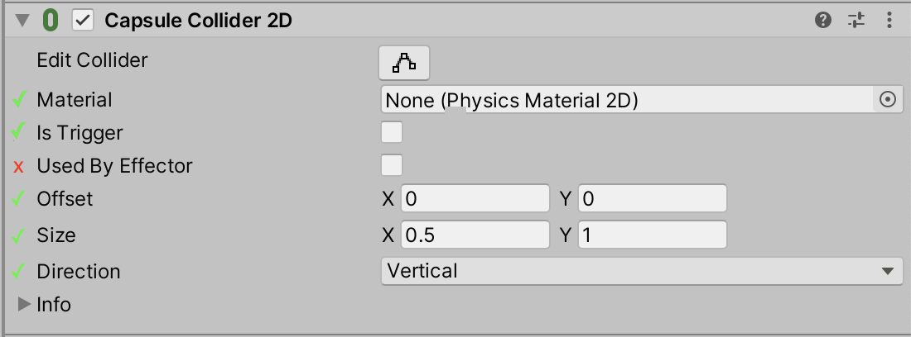 Only properties with green check marks are converted over to the ECS environment.

| Property       | Conversion details                                           |
| -------------- | ------------------------------------------------------------ |
| **Material**   | The Physic Material is copied over as is. If no Material is assigned, then the Physic Material will be taken from Rigidbody2D that owns this Collider instead. If the Rigidbody2D also has no Material assigned, then the default Physic Material will be assigned. |
| **Is Trigger** | Trigger status of the Physic Material is taken into account during conversion. |
| **Offset**     | This is transformed into world space.                        |
| **Size**       | This value is multiplied with `transform.lossyScale`.        |
| **Direction**  | This is used to build the Collider mesh only. It is not included in the final converted data. |

### CircleCollider2D

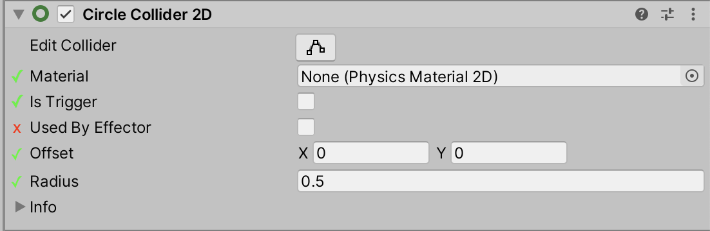

 Only properties with green check marks are converted over to the ECS environment.

| Property       | Conversion details                                           |
| -------------- | ------------------------------------------------------------ |
| **Material**   | The Physic Material is copied over as is. If no Material is assigned, then the Physic Material will be taken from Rigidbody2D that owns this Collider instead. If the Rigidbody2D also has no Material assigned, then the default Physic Material will be assigned. |
| **Is Trigger** | Trigger status is taken into account by the Physic Material during conversion. |
| **Offset**     | Offset is transformed into world space.                      |
| **Radius**     | Radius is multiplied with `transform.lossyScale`.            |

### PolygonCollider2D

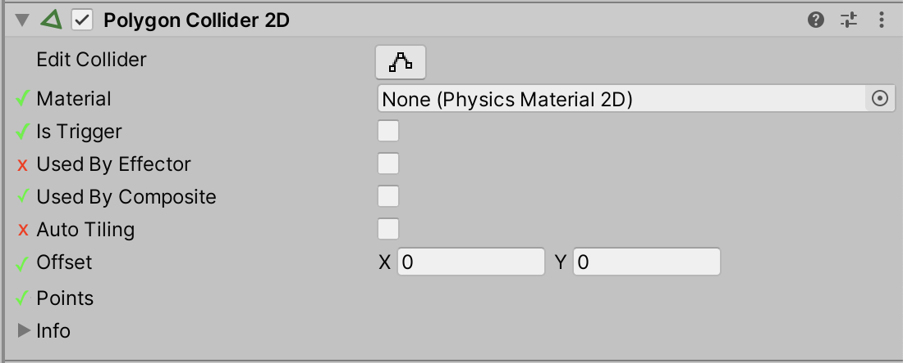 Only properties with green check marks are converted over to the ECS environment.

| Property              | Conversion details                                           |
| --------------------- | ------------------------------------------------------------ |
| **Material**          | The Physic Material is copied over as is. If no Material is assigned, then the Physic Material will be taken from Rigidbody2D that owns this Collider instead. If the Rigidbody2D also has no Material assigned, then the default Physic Material will be assigned. |
| **Is Trigger**        | Trigger status is taken into account by the Physic Material during conversion. |
| **Used By Composite** | If selected, the Collider is **not** converted.              |
| **Offset**            | Offset is transformed into world space.                      |
| **Points**            | In classic Unity, the PolygonCollider2D converts an arbitrary outline into multiple primitive convex polygon shapes which themselves are limited in their number of vertices (8). ECS currently does not support the generation of a primitive 2D polygon mesh. For now, the PhysicsPolygon primitive supports up to 16 vertices which must form a convex polygon. When the PolygonCollider2D is converted, only the first path is converted and only if it has 16 vertices or less. |

### Compound Collider

The ECS system has a hard limitation that only a single component of any type can be on an Entity. When adding multiple Collider 2D components either on the same GameObject or on its children GameObjects, the physics system will convert and combine them into a single compound Collider that contains all the Colliders. This produces a single [BlobAssetReference<Collider>](https://docs.unity3d.com/Packages/com.unity.entities@0.14/manual/ecs_components.html) as outlined above.