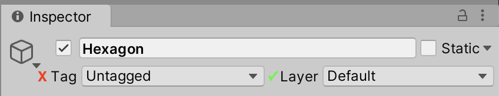

# GameObject conversions

When working with DOTs, GameObjects located inside SubScenes are converted into their [Entity Component System](https://docs.unity3d.com/Packages/com.unity.entities@0.14/manual/ecs_core.html) (ECS) counterparts. This converted data is used during runtime in the DOTs systems. Refer to ECS’ [GameObject Conversion](https://docs.unity3d.com/Packages/com.unity.entities@0.14/manual/gp_overview.html#gameobject-conversion) documentation for more details.

The following section diagrams list the conversion of the components and Assets in 2D Entities.

## Sprite

The mesh and texture data is converted and stored onto an [Entity](https://docs.unity3d.com/Packages/com.unity.entities@0.14/manual/ecs_entities.html) acting as the Atlas for the data. If there are more meshes using the same texture, these meshes are also stored onto the same Entity. 

Apart from the Atlas Entity, Unity also creates an Entity with a [Unity.U2D.Entities.Sprite](xref:Unity.U2D.Entities.Sprite) component. The Sprite component contains two pieces of data:

- Which Atlas Entity its data is stored on. 
- Which index in the array of meshes its mesh is stored at.

For an overview of how the different entities and components interact with each other after conversion, refer to the [diagram](#entitieschart) below.

## Sprite Renderer

Only the following Sprite Renderer and Inspector properties with green check marks are converted over to the ECS environment.

 

| Property             | Conversion details                                           |
| -------------------- | ------------------------------------------------------------ |
| **Layer**            | Converted as is. Is used for selective rendering from camera. |
| **Sprite**           | The [Sprite data is converted](#Sprite) and the [Unity.U2D.Entities.SpriteRenderer](xref:Unity.U2D.Entities.SpriteRenderer) stores a link to the [Unity.U2D.Entities.Sprite](xref:Unity.U2D.Entities.Sprite) Entity |
| **Color**            | Converted into a float4.                                     |
| **Mask Interaction** | Converted into [Unity.U2D.Entities.SpriteMaskInteraction](xref:Unity.U2D.Entities.SpriteMaskInteraction). |
| **Sorting Layer**    | Converted into a short.                                      |
| **Order in Layer**   | Converted into a short.                                      |

Here is a visual representation over how the `UnityEngine.SpriteRenderer` properties map over in ECS:

The following flowchart shows how the different 2D rendering Entities and their components interact with each other: 

