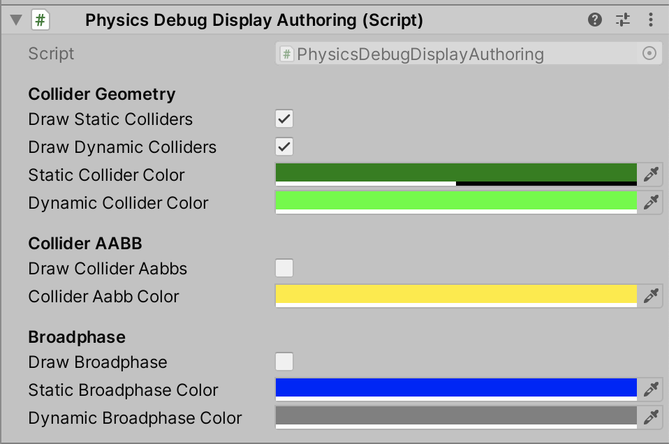

# Frequently asked questions

## Getting started with Tiny

To begin learning about DOTs, refer to the [Entities Component System](https://docs.unity3d.com/Packages/com.unity.entities@0.14/manual/index.html) (ECS) online documentation for general information about DOTs development. Then join the [Project Tiny](https://forum.unity.com/forums/project-tiny.151/) forum for active discussion with fellow users and developers. With every release of Project Tiny, developers share demo projects that showcase how they can be built using Project Tiny.

## Assemblies contained in the package

| **Unity.2D.Entities**                               | Common components and systems                               |
| --------------------------------------------------- | ----------------------------------------------------------- |
| **Unity.2D.Entities.Authoring**                     | Authoring for common 2D components                          |
| **Unity.2D.Entities.Hybrid**                        | Common editor components and systems                        |
| **Unity.2D.Entities.Tiny**                          | Common Project Tiny components and systems                  |
| **Unity.2D.Entities.SpriteRenderer**                | SpriteRenderer specific components and systems              |
| **Unity.2D.Entities.SpriteRenderer.Authoring**      | SpriteRenderer specific authoring                           |
| **Unity.2D.Entities.SpriteRenderer.Authoring.Tiny** | SpriteRenderer specific authoring for Project Tiny          |
| **Unity.2D.Entities.SpriteRenderer.Hybrid**         | SpriteRenderer specific editor components and systems       |
| **Unity.2D.Entities.SpriteRenderer.Tiny**           | SpriteRenderer specific Project Tiny components and systems |
| **Unity.2D.Entities.Physics**                       | Common components and systems for 2D Physics                |
| **Unity.2D.Entities.Physics.Authoring**             | Authoring for common 2D Physics components                  |

## Supported Shaders

This version of 2D Entities does **not** support custom Shaders. The package only supports the following built-in Shaders:

- `Sprites/Default`
- `Universal Render Pipeline/2D/Sprite-Lit-Default`

## Changing the Sprite used by a Sprite Renderer

To change the Sprite use by the Sprite Renderer, change the selected Entity in the Sprite property of the Sprite Renderer to another Entity with a Sprite component. The Sprite Renderer will start using the updated Sprite data for rendering. See below for a code example:

```c#
var renderer = EntityManager.GetComponentData<SpriteRenderer>(spriteRendererEntity);
renderer.Sprite = newSpriteEntity;
EntityManager.SetComponentData(spriteRendererEntity, renderer);
```

## Ensuring Sprite Renderers are drawn as a batch

In 2D Entities we have two pipelines, the in-Editor pipeline and the Dots Runtime pipeline.  In the Editor, the batching system works the same as without Dots. See [here](https://docs.unity3d.com/Manual/DrawCallBatching.html) for more details. In the Dots Runtime, the Sprite Renderers are not batched together.

## Updating the sorting order of a Sprite Renderer at runtime

All Entities with a Sprite Renderer component come with a Renderer2D component. If the sorting values in the Renderer2D component are updated, the Sprite Renderer will be sorted according to the changes. Similar to the default [2D Sorting](https://docs.unity3d.com/Manual/2DSorting.html) of UnityEngine.SpriteRenderer, `Unity.U2D.Entities.SpriteRenderers` are sorted according to the following order:

1. Sort Layer. Higher value means closer to the camera.
2. Sort Order. Higher value means closer to the camera.
3. Distance between the position of the Renderer and the Camera along the Camera’s view direction. For the default 2D setting, this is along the (0, 0, 1) axis.

See below for a code example:

```c#
public class Example : SystemBase
{
   protected override void OnUpdate()
   {
       // Loop over all Entities with SpriteRenderer and Renderer2D components
       Entities
           .WithAll<SpriteRenderer>()
           .ForEach((ref Renderer2D renderer) =>
           {
               // Set SortLayer to 1
               renderer.Layer = 1;
               // Set SortOrder to 2
               renderer.Order = 2;
           }).Schedule();
   }
}
```

## Setting the velocity of a Rigidbody

Rigidbodies with their Body Type set to either Dynamic or Kinematic have a PhysicsVelocity component added to the Entity during conversion. Updating this component’s data during runtime will cause the Rigidbody to change its velocity. See below for a code example:

```c#
public class Example : SystemBase
{
   protected override void OnStartRunning()
   {
       // Loop over all Entities with a PhysicsVelocity component
       Entities
           .ForEach((ref PhysicsVelocity velocity) =>
           {
               // Set linear velocity to 1 in the x-axis
               velocity.Linear = new float2(1f, 0f);
           }).Schedule();
   }
   protected override void OnUpdate() { }
}
```

## Checking if a point is inside a Collider

Refer to the code example below:

```c#
public class Example : SystemBase
{
   protected override void OnUpdate()
   {
       // Fetch the PhysicsWorld through the PhysicsWorldSystem
       var worldSystem = World.GetExistingSystem<PhysicsWorldSystem>();
       var physicsWorld = worldSystem.PhysicsWorld;

       // Create an input object to define the point data
       var point = new OverlapPointInput()
       {
           Position = float2.zero,
           Filter = CollisionFilter.Default
       };

       // Check if any of the colliders in the world are overlapping the point
       if (physicsWorld.OverlapPoint(point))
       {
           // Hit!
       }
   }
}
```

## Checking if a ray hits a Collider

Refer to the code example below:

```c#
public class Example : SystemBase
{
   protected override void OnUpdate()
   {
       // Fetch the PhysicsWorld through the PhysicsWorldSystem
       var worldSystem = World.GetExistingSystem<PhysicsWorldSystem>();
       var physicsWorld = worldSystem.PhysicsWorld;

       // Create an input object to define the ray data
       var ray = new RaycastInput()
       {
           Start = float2.zero,
           End = new float2(1f, 0f),
           Filter = CollisionFilter.Default
       };

       // Check if the given ray is hitting any of the colliders in the world
       if (physicsWorld.CastRay(ray))
       {
           // Hit!
       }
   }
}
```

##  Checking if a Collider intersects another Collider

Refer to the code example below:

```c#
public class Example : SystemBase
{
   protected override void OnUpdate()
   {
       // Fetch the PhysicsWorld through the PhysicsWorldSystem
       var worldSystem = World.GetExistingSystem<PhysicsWorldSystem>();
       var physicsWorld = worldSystem.PhysicsWorld;

       // Fetch all colliders in the world and put them into a NativeArray.
       // Note that we do this to easily demonstrate the collider intersection check.
       // A better approach here would be to use a specific component/component tag so        
       // that the query is more exact to what you are looking for.
       var colliderQuery = GetEntityQuery(ComponentType.ReadOnly<PhysicsColliderBlob>());
       var allColliders = colliderQuery.ToComponentDataArray<PhysicsColliderBlob>(Allocator.Temp);

       // If no colliders in the world, return
       if (allColliders.Length == 0)
           return;

       // Create an input object with which collider should be used to test
       // the overlapping
       var colliderInput = new OverlapColliderInput()
       {
           Collider = allColliders[0].Collider,
           Filter = CollisionFilter.Default
       };

       // Check if the given collider is overlapping any of the other colliders in the world
       if (physicsWorld.OverlapCollider(colliderInput))
       {
           // Hit!
       }
   }
}
```

## Performing a Collider cast

Refer to the code example below: 

```c#
public class Example : SystemBase
{
   protected override void OnUpdate()
   {
       // Fetch the PhysicsWorld through the PhysicsWorldSystem
       var worldSystem = World.GetExistingSystem<PhysicsWorldSystem>();
       var physicsWorld = worldSystem.PhysicsWorld;

       // Fetch all colliders in the world and put them into a NativeArray.
       // Note that we do this to easily demonstrate the collider intersection check.
       // A better approach here would be to use a specific component/component tag so       
       // that the query is more exact to what you are looking for.
       var colliderQuery = GetEntityQuery(ComponentType.ReadOnly<PhysicsColliderBlob>());
       var allColliders = colliderQuery.ToComponentDataArray<PhysicsColliderBlob>(Allocator.Temp);

       // If no colliders in the world, return
       if (allColliders.Length == 0)
           return;

       // Create an input object with the selected collider to be cast
       // Also define the Start and End of the cast
       var colliderInput = new ColliderCastInput()
       {
           Collider = allColliders[0].Collider,
           Start = float2.zero,
           End = new float2(1f, 0f),
       };

       // Check if the given collider is colliding with any colliders in the world
       if (physicsWorld.CastCollider(colliderInput, out var hit
))
       {
           var entityHit = hit.Entity;
       }
   }
}
```

## Checking the distance to a point

Refer to the code example below: 

```c#
public class Example : SystemBase
{
   protected override void OnUpdate()
   {
       // Fetch the PhysicsWorld through the PhysicsWorldSystem
       var worldSystem = World.GetExistingSystem<PhysicsWorldSystem>();
       var physicsWorld = worldSystem.PhysicsWorld;
      
       // Create an input object to define the point distance data
       var pointInput = new PointDistanceInput()
       {
           Filter = CollisionFilter.Default,
           Position = float2.zero,
           MaxDistance = 10f
       };

       // Check if any colliders were hit
       if (physicsWorld.CalculateDistance(pointInput, out var hit))
       {
           // Get the distance to the collider hit
           var distanceToHit = hit.Distance;
       }
   }
}
```

## Checking the distance between Colliders

Refer to the code example below: 

```c#
public class Example : SystemBase
{
   protected override void OnUpdate()
   {
       // Fetch the PhysicsWorld through the PhysicsWorldSystem
       var worldSystem = World.GetExistingSystem<PhysicsWorldSystem>();
       var physicsWorld = worldSystem.PhysicsWorld;

       // Fetch all colliders in the world and put them into a NativeArray.
       // Note that we do this to easily demonstrate the collider intersection check.
       // A better approach here would be to use a specific component/component tag so       
       // that the query is more exact to what you are looking for.
       var colliderQuery = GetEntityQuery(ComponentType.ReadOnly<PhysicsColliderBlob>(), ComponentType.ReadOnly<Translation>());
       var allColliders = colliderQuery.ToComponentDataArray<PhysicsColliderBlob>(Allocator.Temp);
       var colliderTranslations = colliderQuery.ToComponentDataArray<Translation>(Allocator.Temp);

       // If no colliders in the world, return
       if (allColliders.Length == 0)
           return;

       // Create an input object to define the collider distance data
       var colliderInput = new ColliderDistanceInput()
       {
           Collider = allColliders[0].Collider,
           Transform = new PhysicsTransform(colliderTranslations[0].Value.xy),
           MaxDistance = 10f
       };

       // Check if any colliders were hit
       if (physicsWorld.CalculateDistance(colliderInput, out var hit))
       {
           // Get the distance to the collider hit
           var distanceToHit = hit.Distance;
       }
   }
}
```

## Creating a Collider directly in DOTs

You can create Colliders directly in the DOTs environment without needing to use the automatic GameObject conversion system. To do this, populate a specific geometry structure and pass it to the Collider. Create a method for the specific type you wish to create depending on their Geometry Type:

| **Physics Collider Type** | **Geometry Type**        |
| ------------------------- | ------------------------ |
| PhysicsBoxCollider        | BoxGeometry              |
| PhysicsCapsuleCollider    | CapsuleGeometry          |
| PhysicsCircleCollider     | CircleGeometry           |
| PhysicsPolygonCollider    | PolygonGeometry          |
| PhysicsCompoundCollider   | Array of Child Colliders |

For example, create a circle Collider with the following script:

```c#
public class Example : SystemBase
{
   protected override void OnCreate()
   {
       // This will create a collider with default CollisionFilter and PhysicsMaterial
       var collider = PhysicsCircleCollider.Create(new CircleGeometry()
       {
           Center = float2.zero,
           Radius = 1.5f
       });
      
       var entity = EntityManager.CreateEntity(typeof(LocalToWorld));
       EntityManager.AddComponentData(entity, new PhysicsColliderBlob()
       {
           Collider = collider
       });
       EntityManager.AddComponentData(entity, new PhysicsColliderBlobOwner()
       {
           Collider = collider
       });
   }

   protected override void OnUpdate() { }
}
```

## Debugging Physics

To aid in debugging, add a PhysicsDebugDisplay component to a GameObject in your SubScene. This component has options that allow you to see the Collider outlines, Collider AABB and the Broadphase. You can also configure the colors used to draw them. Note however that this component only works in the Editor and can result in significant performance reduction due to the line drawing used. In the future, this will be significantly improved and even be supported in builds outside the Editor.

**Note:** When going into Play mode, the classic 2D physics engine will run so class GameObject components in a SubScene will be simulated when the SubScene is open for editing. This won’t be the case when the SubScene is closed or for player builds. To get around this, you can turn off 2D auto-simulation in the **Project Settings > Physics 2D > Auto Simulation** or via [script](https://docs.unity3d.com/ScriptReference/Physics2D-autoSimulation.html). When auto-simulation is turned off, the 2d physics simulation will not be executed, however you will still see the gizmos of the classic 2D Colliders in the scene.

## Disabling the Collider outlines

Select the appropriate checkbox in the PhysicsDebugDisplay component:



## Gaining access to everything in the physics world

Use the `PhysicsWorldSystem.PhysicsWorld` field. For example:

```c#
var worldSystem = World.GetExistingSystem<PhysicsWorldSystem>();
var physicsWorld = worldSystem.PhysicsWorld;
```

## Changing the physics world settings

Change the PhysicsSettings using the PhysicsWorld’s Settings property. For example: 

```c#
var worldSystem = World.GetExistingSystem<PhysicsWorldSystem>();
var physicsWorld = worldSystem.PhysicsWorld;
// Change the gravity to move right
physicsWorld.Settings.Gravity = new float2(9.81f, 0f);
```

## Accessing a converted PhysicsBody

Use the `PhysicsWorld.CollisionWorld` field. For example:

```c#
var worldSystem = World.GetExistingSystem<PhysicsWorldSystem>();
var physicsWorld = worldSystem.PhysicsWorld;
var allBodies = physicsWorld.CollisionWorld.AllBodies;
```

## Getting the PhysicsBody built from a specific Entity

Use PhysicsBody `GetPhysicsBody(Entity)`, for example:

```c#
var worldSystem = World.GetExistingSystem<PhysicsWorldSystem>();
var physicsBody = worldSystem.GetPhysicsBody(myEntity);
```

Or int `GetPhysicsBodyIndex(Entity)`:

```c#
var worldSystem = World.GetExistingSystem<PhysicsWorldSystem>();
var physicsBodyIndex = worldSystem.GetPhysicsBodyIndex(myEntity);
```

**Note:** PhysicsWorld is built every frame, to ensure that the returned value is from the current frame, set up a callback by referring to to the following steps for scheduling a job.

## Scheduling a job to run before the Physics World is built

Refer to the code example below: 

```c#
[UpdateBefore(typeof(PhysicsWorldSystem))]
public class Example : SystemBase
{
   protected override void OnUpdate()
   {
       JobHandle physicsCallback(ref PhysicsWorld physicsWorld, JobHandle dependencyHandle)
       {
           // Do some work here.

           // If you schedule a job then ensure its dependency is "DependencyHandle"
           // and return your job handle here instead.
           return dependencyHandle;
       }
       // Schedule a callback.
       var worldSystem = World.GetExistingSystem<PhysicsWorldSystem>();
       worldSystem.ScheduleCallback(PhysicsCallbacks.Phase.PreBuild, physicsCallback);
   }
}
```

## Scheduling a job to run after the Physics World is built but before the simulation has stepped

Refer to the code example below: 

```c#
[UpdateBefore(typeof(PhysicsWorldSystem))]
public class Example : SystemBase
{
       protected override void OnUpdate()
       {
           JobHandle physicsCallback(ref PhysicsWorld physicsWorld, JobHandle dependencyHandle)
           {
               // Do some work here.
               // If you schedule a job then ensure its dependency is "DependencyHandle"
               // and return your job handle here instead.
               return dependencyHandle;
           }

           // Schedule a callback.
           var worldSystem = World.GetExistingSystem<PhysicsWorldSystem>();
           worldSystem.ScheduleCallback(PhysicsCallbacks.Phase.PreStepSimulation, physicsCallback);
       }
}
```

