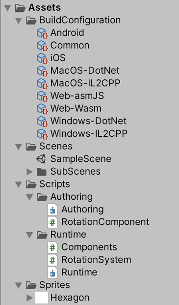
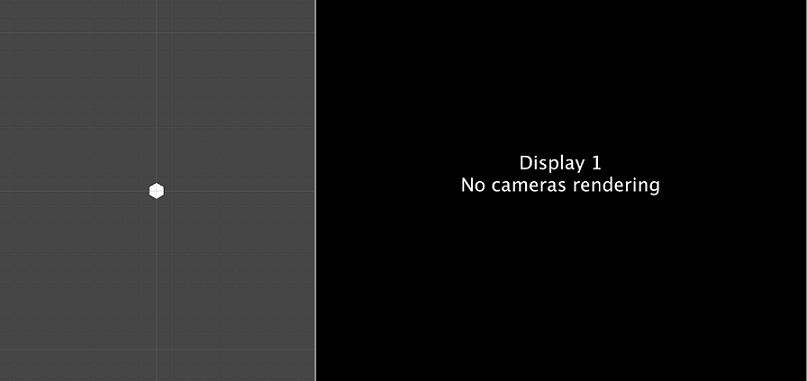
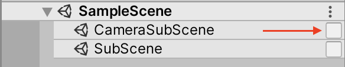
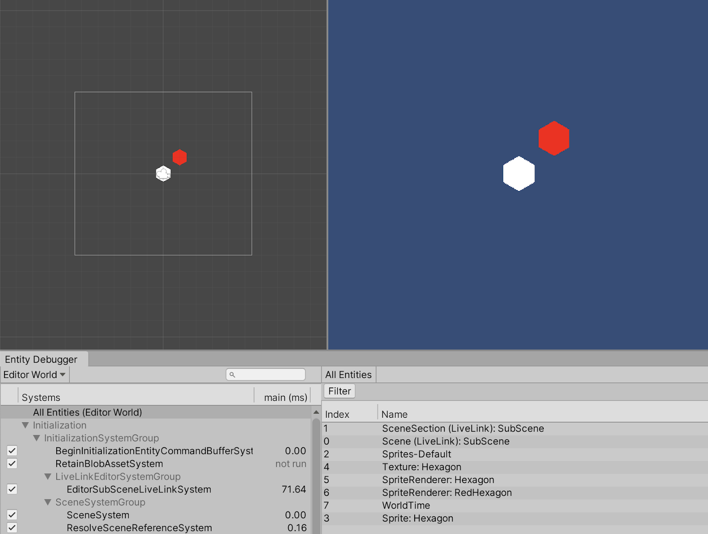
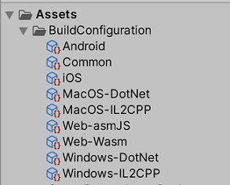
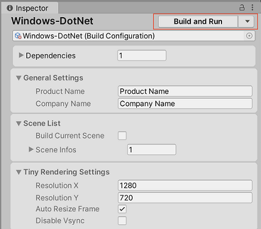

# Getting started with 2D Entities

To begin using the 2D Entities package, please refer to Project Tiny’s [System Requirements](https://docs.google.com/document/d/1A8hen2hLFY5FLkC5gd3JP2Z-IpHfnAX-CpYLK3aOdwA/edit#heading=h.od6pqxv78b97) as well as the specific 2D Entities package [requirements](index.html#requirements), to ensure that you download and install everything necessary to begin developing Project Tiny applications. 

Once you have installed the required Editor version and third party tools, download the pre-configured project template [2D Entities Starter](https://github.com/Unity-Technologies/2D-Entities-Starter/archive/0.29.0-preview.3.zip). This project comes with assets, Scenes and scripts set up for Project Tiny development, allowing you to go straight into developing your new Project Tiny application.

The 2D Entities Starter project contains the following: 

- **Build Configurations**, which let you create a Project Tiny executable on the selected platform.

- One Scene and two SubScenes.

- Two script folders: 

- - The `Authoring` folder contains scripts for authoring of data into the [ECS](https://docs.unity3d.com/Packages/com.unity.entities@0.14/manual/index.html) world. 
  - The `Runtime` folder contains scripts related to the runtime systems of the ECS world.

  

List of assets included in the 2D Entities Stater project.

## Enabling the Game view

When you open `SampleScene.unity`, the Game view camera initially does not display the content of the Scene:

 A hexagon Sprite is visible in the Scene view (left) which the Game view (right) does not display.

The Scene contains a hexagon Sprite that is visible in the Scene view, but the Game view only displays a black screen with the message that “No cameras rendering”. This is because the camera is located inside **CameraSubScene**, which is closed by default. When a SubScene is closed, its GameObject content is removed and only the ECS data remains. In the Editor, Cameras need to have a GameObject representation. To generate the GameObject representation, turn on Edit Mode for the CameraSubScene by selecting the checkbox next to the CameraSubScene in the Hierarchy window:

 Select the checkbox to have the Game view render the Scene correctly.

## Rendering 2D content

Adding a new Sprite to your Scene in DOTS is similar to adding a Sprite in the regular [2D workflow](https://docs.unity3d.com/Manual/Sprites.html). Drag the Sprite you would like to use into the scene, and a GameObject with a Sprite Renderer component referencing the Sprite you selected appears in the Scene. Drag the new GameObject into the SubScene to include it in the [GameObject conversion](Conversion.md).

You can now [create an executable](#creating-a-new-executable), and the recently added Sprite should be visible in the build. 

## Enabling Physics

Adding a Rigidbody2D to a GameObject in DOTs is also similar to the steps in the regular 2D workflow. Select the GameObject you want to add a Rigidbody2D on to, then in its Inspector window, select **Add Components** and enter ‘Rigidbody2D’ into the search box at the top. Select ‘Rigidbody2D’ to add the component to the GameObject. 

Ensure that the GameObject you have added the Rigidbody2D to is located inside a SubScene, so that the GameObject and its components are properly converted over to the ECS world. To test that the addition of a Rigidbody2D was successful, create a new executable, and the GameObject should start falling on startup if the Rigidbody2D has its default values.

## Creating a new executable

The 2D Entities Starter project comes with build configurations already setup and ready to use. Select the desired build configuration, then select the **Build And Run** button at the top of the build configurations Inspector window.

For more information and details about the different build configurations, please refer to the [Running and Debugging: Build Configurations](https://docs.google.com/document/d/1A8hen2hLFY5FLkC5gd3JP2Z-IpHfnAX-CpYLK3aOdwA/edit#heading=h.w2hio8mvczwa) in the Project Tiny online documentation.

