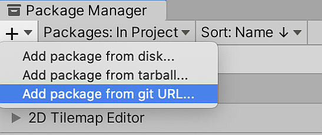
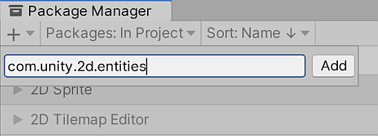

# Getting started with 2D Entities

To begin using the 2D Entities package, please refer to Project Tiny’s [System Requirements](https://docs.google.com/document/d/1A8hen2hLFY5FLkC5gd3JP2Z-IpHfnAX-CpYLK3aOdwA/edit#heading=h.od6pqxv78b97) as well as the specific 2D Entities package [requirements](index.html#requirements), to ensure that you download and install everything necessary to begin developing Project Tiny applications.

Once you have installed the required Editor version and third party tools, download the preconfigured Project template `Tiny2D` from the [ProjectTinySamples](https://github.com/Unity-Technologies/ProjectTinySamples) repository. Open `Tiny2D `and go to the [Package Manager](https://docs.unity3d.com/Manual/upm-ui.html) (menu: **Window > Package Manager**). Select the **Add** (**+**) button at the upper-left corner of the window, and select **Add package from git URL…** 

Enter `com.unity.2d.entities` into the box and then select **Add** to download the 2D Entities package and add it to the Project.

## Rendering 2D content

Adding a new Sprite to your Scene in DOTS is similar to adding a Sprite in the regular [2D workflow](https://docs.unity3d.com/Manual/Sprites.html). Drag the Sprite you would like to use into the scene, and a GameObject with a Sprite Renderer component referencing the Sprite you selected appears in the Scene. Drag the new GameObject into the SubScene to include it in the [GameObject conversion](Conversion.md).

