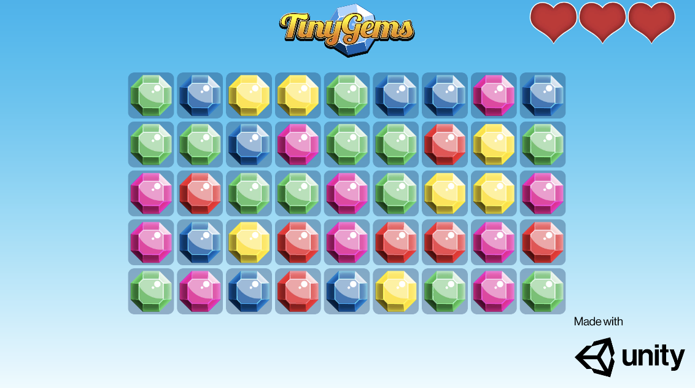

# 2D Entities

## Included in this package

[Rendering](2D-rendering)

- Sprite conversion
- Sprite Renderer conversion
- Sprites/Default Material conversion
- Sprite Atlas conversion
- Runtime 2D rendering pipeline
- Editor 2D rendering pipeline

[Physical Collision Detection](2D-physics)

- Primitive colliders conversion
- Rigidbody2D conversion
- Physics broadphase
- Broadphase querying API
- Compound collider conversion

## Quick start

To get started quickly, download the [2D Entities Starter](https://github.com/Unity-Technologies/2D-Entities-Starter/archive/0.22.0-preview.7.zip) template Project. This Project has everything setup for you to get started with the 2D Entities package. Refer to the [Getting started with 2D Rendering](2D-rendering.md) page for more information.

## 2D Rendering

This feature set contains the tools to work with and render 2D content in the [DOTS](https://docs.google.com/document/d/1A8hen2hLFY5FLkC5gd3JP2Z-IpHfnAX-CpYLK3aOdwA/edit?usp=sharing) Runtime. 

## Requirements

This version of 2D Entities is compatible with the following versions of the Unity Editor:

- 2019.3.0f6 and newer

## Assemblies in the package

| __Unity.2D.Entities__                   | Core assembly for the 2D Entities package                    |
| --------------------------------------- | ------------------------------------------------------------ |
| __Unity.2D.Entities.Authoring__         | Authoring assembly for all 2D MonoBehaviours                 |
| __Unity.2D.Entities.Runtime__           | Runtime assembly containing the rendering pipeline for the runtime |
| __Unity.2D.Hybrid__                     | Hybrid assembly containing the rendering pipeline for the editor |
| __Unity.2D.Entities.Physics__           | Core assembly for the 2D Physics package                     |
| __Unity.2D.Entities.Physics.Authoring__ | Authoring assembly for all 2D Physics MonoBehaviours         |

---

If you have any issues or questions about the 2D Entities package and its features, please visit the [Project Tiny](https://forum.unity.com/forums/project-tiny.151/) forum and [First batch of 2D Features for Project Tiny is now available](https://forum.unity.com/threads/first-batch-of-2d-features-for-project-tiny-is-now-available.830652/) thread for more information and discussions with the development team.